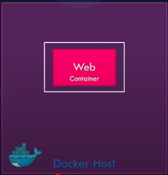

# Networking in Docker

default networks:

1) bridge
2) none
3) host

#### bridge

`docker run ubuntu` 

private internal network created by docker on the host. All containers attached to this network and they get an internal ip address usually in the range 172.17 series. 

 

#### none

`docker run ubuntu --network=none`

isolated container

</img>

#### host

`docker run ubuntu --network=host` 

directly connected to host network. 

>  multiple containers running on same port is not possible.

</img>

